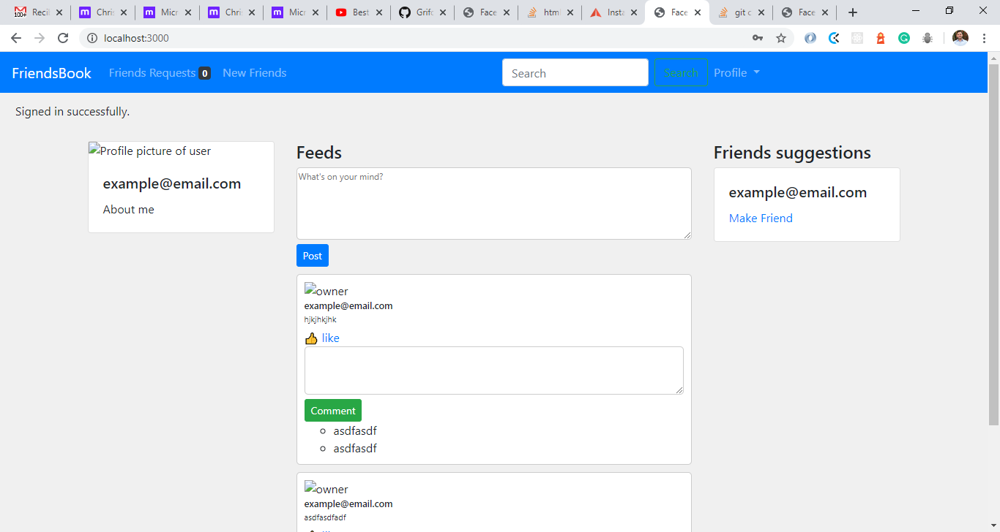

# Facebook-like application with Ruby on Rails

> This is part of the Forms Project in The Odin Project’s Ruby on Rails Curriculum. Find it at https://www.theodinproject.com/courses/ruby-on-rails/lessons/final-project and requirement from Microverse Program.

## Live link

* https://nameless-lowlands-03701.herokuapp.com/

## Built With ✨

- Ruby Version 2.6.5
- Rails 6.0.1

To get a local copy up and running follow these simple example steps.

### Prerequisites
* Ruby version
You will need Ruby Version 2.6.5

* System dependencies
Windows/ Mac
Rails 6.0.1

### Install
Clone project and run
`bundle install --without production`

 Start the rails server
`rails server`

## How to contribute and partipate
Fork this repo and submit a PR for review and potential merge to main branch

## Authors

👨‍💻 **Edem Agbenyo**

- Github: [@edemagbenyo](https://github.com/edemagbenyo)

👨‍💻 **Christian Salazar**

- Github: [@grifo89](https://github.com/grifo89)
